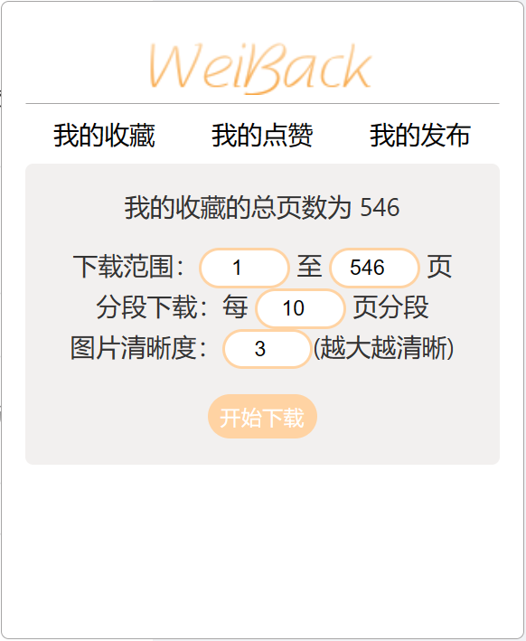

# WeiBack

WeiBack 是一个帮助微博用户备份自己数据的 [油猴 (Tampermonkey)](https://www.tampermonkey.net/) 脚本。

*本项目仅为技术学习和交流，本人拒绝为任何商业或非法目的提供任何技术支持，请在遵守当地相关法律法规的前提下使用本项目*

## 亮点

- 拥有简洁和直观的使用界面，操作方便，用户友好
- 良好的备份进度和状态提示
- 导出格式为 HTML，通过主流浏览器可打开
- 导出的 HTML 页面外观与 Weibo 原生界面接近，阅读体验良好
- 导出的 HTML 页面代码结构简单，可使用 Chrome/Firefox 等主流浏览器无痛转换成 PDF 格式

## 安装

- 通过 **Greasyfork**：进入 [微博备份](https://greasyfork.org/zh-CN/scripts/466100-%E5%BE%AE%E5%8D%9A%E5%A4%87%E4%BB%BD)，直接安装本脚本
- Clone 本项目到本地，执行 make 生成脚本文件后手动安装到 Tampermonkey

## 使用

### 基础

1. 安装脚本完毕后，打开微博，右侧自然出现操作窗口。

   

2. 目前本脚本包含下载自己的微博发布、收藏和点赞的功能，点击对应的按钮进入对应数据的下载页。

3. 备份以 **页** 为单位，每页有二十条博文。在输入框中输入自已需要的页面范围，默认下载全部数据。

4. 为防止保存文件过大，自动对备份数据分文件保存，可在输入框进行设置。默认10页存一个文件，最大可设置20页。

5. 备份图片大小可设置。目前分为三个等级，等级越大图片越大越清晰。可在输入框设置。

6. 点击 **开始下载** 即可开始备份。

7. 备份完成后，数据将被自动保存到本地。

8. 目前下载格式为包含 HTML 文件和其图片资源的 zip 压缩包，解压后使可用主流浏览器（Chrome/Firefox/Edge）打开。

9. 保存他人微博的方法类似，但是需要输入对方的用户id，这是一串十位的数字。用户id的获取方法：点进对方主页，对方主页地址后缀即为id，如 https://weibo.com/u/1111681197 中 1111681197 为需要输入的id。

### 技巧

#### 导出为PDF：

使用浏览器打开已经下载解压完毕的 HTML 文件，在浏览器菜单中选择打印（快捷键 Ctrl-p），选择输出为 PDF。

#### 图片浏览

为不影响排版，导出的 html 里图片长宽均做了限制，所以实际清晰的图看上去可能模糊。可右键点击想看的图片，选中在新标签查看，即可查看大图。或者配合 Picviewer CE+ 等油猴脚本使用，方便地速览图片。

### 注意

- 过快的接口请求频率会增加微博官方的负载，可能增加被 ban 甚至是法律风险。因此本脚本对每个请求设置了一个合理的等待时间以匹配人类的划动速度，因此备份数据量较大时可能耗时较长，请耐心等待，先去泡杯咖啡。本脚本仅为解放人手于繁重的操作，合理、适度地使用脚本乃长久之计。
- 备份期间建议不要进行点赞、增删、收藏等操作，以免 weibo 服务器返回的数据错位，导致备份数据的重复或遗漏。
- 使用时注意输入的合法性，比如应该输入数字的地方不要输入文字，否则运行结果不可预知——代码里我懒得做太多边界检查了。

## 计划

- ~~对视频生成封面，优化阅读体验~~
- ~~增加分段下载配置~~
- ~~增加图片默认保存质量设置功能，当前默认保存最高质量的图片~~
- ~~优化代码的结构和报错、日志~~
- ~~增加获取只能在客户端查看的微博~~
- ~~增加备份指定用户博文的功能（待定，目前已经有相关项目了）~~
- ~~不打算开发保存视频到本地的功能，因为视频文件太大，而且存在电影等巨型文件。对于特别喜爱的个别视频建议点击相应链接后用其它视频抓取工具进行下载，不值得一次性下载所有视频。~~
- 将 JavaScript 代码用 ReScript 重写
- 对带封面的链接生成封面，优化导出页面的阅读体验

## 其它

部分微博只能在客户端查看，我希望这部分微博也能被保存下来。但是研究了下发现因为跨站的原因，油猴脚本没法实现这个功能（第一次写 js 前端代码，不是很熟，如果有大佬知道解决办法希望能教教我，提前感谢）。

所以开了个新仓库打算写个本地的软件实现这个功能，目前（2023/7/4）已经写完主要部分，有时间会写完。有需要的可以关注下： https://github.com/Shapooo/weiback-rs 。

除此之外，脚本终究有诸多限制，没法做得很复杂。在本地就可以玩出许多花样，将原始数据保存到数据库里，随时导出成 html，或者设置条件筛选出符合的微博导出，批量化将已经保存的微博取消收藏......

第一个可用版本应该很快就要出世了，看我空闲时间......

## 日志

2023-05-12 0.1 完成最基本的功能，能够拉取原始json数据文件进行备份

2023-05-15 0.2 完成html格式保存功能

2023-05-20 0.3 完成分段下载功能

2023-05-20 0.3 优化链接显示标题

2023-05-20 0.3 增加对图片、视频混合型微博支持

2023-05-20 0.3 增加对 www.weibo.com 的支持

2023-05-22 0.4 本地图片缓存添加 lru 算法

2023-05-23 0.4 将图片获取变为串行，减小下载连接被 reset 的可能性

2023-05-23 0.4 为图片下载增加了重试机制

2023-05-23 0.4 增加了备份失败时的提示，方便用户反馈问题

2023-05-23 0.4 修复若干问题

2023-05-28 0.5 修复若干问题

2023-05-28 0.5 增加分段下载设置功能

2023-05-28 0.5 增加图片大小设置功能

2023-06-11 0.6 修复无法下载全部微博的问题

2023-06-14 0.7 增加下载他人微博的功能

2023-07-04 0.8 修复若干问题

2023-07-04 0.8 用上了前端的工具链yarn、vite

2023-08-09 0.8.1 修复 avatar_hd undefined 的问题

2023-08-09 0.8.2 绕过微博返回 isLongText 字段错误的问题

2023-09-22 0.9 添加是否下载图片选项

## Bugs/Requests

通过 [github issue tracker](https://github.com/Shapooo/WeiBack/issues) 提交问题和需求，或通过  [Greasyfork](https://greasyfork.org/zh-CN/scripts/466100-%E5%BE%AE%E5%8D%9A%E5%A4%87%E4%BB%BD/feedback) 进行反馈，优先选择github。

## 其它

感谢 [炸号微博备份](https://greasyfork.org/zh-CN/scripts/445022-%E7%82%B8%E5%8F%B7%E5%BE%AE%E5%8D%9A%E5%A4%87%E4%BB%BD) ，本项目受其影响并在初始版本使用其部分代码。因该脚本有时间未更新且存在bug便有了本项目的诞生。

本项目使用了 [JSZip](https://stuk.github.io/jszip/) 和 [FileSaver.js](https://github.com/eligrey/FileSaver.js/)。

## 协议

Copyright Shapooo, 2023.

Distributed under the terms of the [GPL](https://github.com/Shapooo/WeiBack/blob/master/LICENSE)
